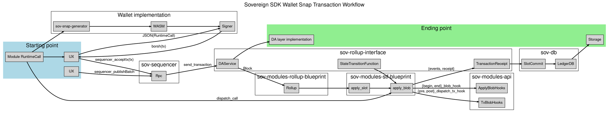

```dot
digraph tx_flow {
    graph [
        label = "Sovereign SDK Wallet Snap Transaction Workflow"
        labelloc = t
        fontname = "Helvetica,Arial,sans-serif"
        fontsize = 20
        layout = dot
        rankdir = LR
        newrank = true
    ]
    node [
        style=filled
        shape=rect
        fontname="Helvetica,Arial,sans-serif"
    ]
    edge [
        arrowsize=0.5
        fontname="Helvetica,Arial,sans-serif"
        penwidth=2
    ]

    subgraph cluster_start {
        style=filled;
        color=lightblue;

        ux_tx [label="UX"]
        ux_submit [label="UX"]
        module_runtime [label="Module RuntimeCall"]

        label = "Starting point"
    }

    subgraph cluster_wallet {
        sov_snap_generator [label="sov-snap-generator"]
        wallet_wasm [label="WASM"]
        wallet_signer [label="Signer"]

        label = "Wallet implementation"
    }

    subgraph cluster_sov_sequencer {
        sequencer_rpc [label="Rpc"]

        label = "sov-sequencer"
    }

    subgraph cluster_sov_rollup_interface {
        rollup_state_transition_function [label="StateTransitionFunction"]
        rollup_da_service [label="DAService"]
        rollup_tx_receipt [label="TransactionReceipt"]

        label = "sov-rollup-interface"
    }

    subgraph cluster_sov_db {
        db_slot_commit [label="SlotCommit"]
        db_ledger [label="LedgerDB"]

        label = "sov-db"
    }

    subgraph cluster_sov_modules_api {
        module_apply_blob_hooks [label="ApplyBlobHooks"]
        module_tx_hooks [label="TxBlobHooks"]

        label = "sov-modules-api"
    }

    subgraph cluster_stf_blueprint {
        apply_slot [label="apply_slot"]
        apply_blob [label="apply_blob"]

        label = "sov-modules-stf-blueprint"
    }

    subgraph cluster_rollup_blueprint {
        rollup [label="Rollup"]

        label = "sov-modules-rollup-blueprint"
    }

    subgraph cluster_end {
        style=filled;
        color=lightgreen;

        da_service [label="DA layer implementation"]
        storage [label="Storage"]

        label = "Ending point"
    }

    module_runtime -> ux_tx
    ux_tx -> wallet_signer [label="JSON(RuntimeCall)"]
    wallet_signer -> ux_tx [label="borsh(tx)"]
    ux_tx -> sequencer_rpc [label="sequencer_accepttx(tx)"]
    ux_submit -> sequencer_rpc [label="sequencer_publishBatch"]
    module_runtime -> sov_snap_generator
    sov_snap_generator -> wallet_wasm
    wallet_wasm -> wallet_signer
    sequencer_rpc -> rollup_da_service [label="send_transaction"]
    rollup_da_service -> rollup [label="Block"]
    rollup_da_service -> da_service

    rollup -> apply_slot
    apply_slot -> apply_blob

    rollup_state_transition_function -> apply_blob
    apply_blob -> module_apply_blob_hooks [label="{begin, end}_blob_hook"]
    apply_blob -> module_tx_hooks [label="{pre, post}_dispatch_tx_hook"]
    apply_blob -> rollup_tx_receipt [label="{events, receipt}"]
    module_runtime -> apply_blob [label="dispatch_call"]

    rollup_tx_receipt -> db_slot_commit
    db_slot_commit -> db_ledger
    db_ledger -> storage
}
```
