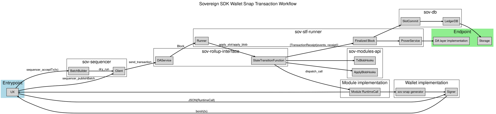

```dot
digraph tx_flow {
    graph [
        label = "Sovereign SDK Wallet Snap Transaction Workflow"
        labelloc = t
        fontname = "Helvetica,Arial,sans-serif"
        fontsize = 20
        layout = dot
        rankdir = LR
        newrank = true
    ]
    node [
        style=filled
        shape=rect
        fontname="Helvetica,Arial,sans-serif"
    ]
    edge [
        arrowsize=0.5
        fontname="Helvetica,Arial,sans-serif"
        penwidth=2
    ]

    subgraph cluster_start {
        style=filled;
        color=lightblue;

        ux [label="UX"]

        label = "Entrypoint"
    }

    subgraph cluster_module {
        module_runtime [label="Module RuntimeCall"]

        label = "Module implementation"
    }

    subgraph cluster_wallet {
        sov_snap_generator [label="sov-snap-generator"]
        wallet_signer [label="Signer"]

        label = "Wallet implementation"
    }

    subgraph cluster_sov_sequencer {
        sequencer_batch_builder [label="BatchBuilder"]
        sequencer_client [label="Client"]

        sequencer_batch_builder -> sequencer_client [label="dry_run"]

        label = "sov-sequencer"
    }

    subgraph cluster_sov_rollup_interface {
        rollup_state_transition_function [label="StateTransitionFunction"]
        rollup_da_service [label="DAService"]

        label = "sov-rollup-interface"
    }

    subgraph cluster_sov_stf_runner {
        runner [label="Runner"]
        runner_prover [label="ProverService"]
        runner_finalized_block [label="Finalized Block"]

        label = "sov-stf-runner"
    }

    subgraph cluster_sov_db {
        db_slot_commit [label="SlotCommit"]
        db_ledger [label="LedgerDB"]

        label = "sov-db"
    }

    subgraph cluster_sov_modules_api {
        module_apply_blob_hooks [label="ApplyBlobHooks"]
        module_tx_hooks [label="TxBlobHooks"]

        label = "sov-modules-api"
    }

    subgraph cluster_end {
        style=filled;
        color=lightgreen;

        da_service [label="DA layer implementation"]
        storage [label="Storage"]

        label = "Endpoint"
    }

    module_runtime -> ux
    ux -> wallet_signer [label="JSON(RuntimeCall)"]
    wallet_signer -> ux [label="borsh(tx)"]
    ux -> sequencer_batch_builder [label="sequencer_acceptTx(tx)"]
    ux -> sequencer_client [label="sequencer_publishBatch"]
    module_runtime -> sov_snap_generator
    sov_snap_generator -> wallet_signer
    sequencer_client -> rollup_da_service [label="send_transaction"]
    rollup_da_service -> runner [label="Block"]

    runner -> rollup_state_transition_function [label="apply_slot/apply_blob"]

    rollup_state_transition_function -> module_apply_blob_hooks
    rollup_state_transition_function -> module_tx_hooks
    rollup_state_transition_function -> runner_finalized_block [label="[TransactionReceipt{events, receipt}]"]
    rollup_state_transition_function -> module_runtime [label="dispatch_call"]

    runner_finalized_block -> runner_prover
    runner_finalized_block -> db_slot_commit
    db_slot_commit -> db_ledger
    db_ledger -> storage
    runner_prover -> da_service
}
```
